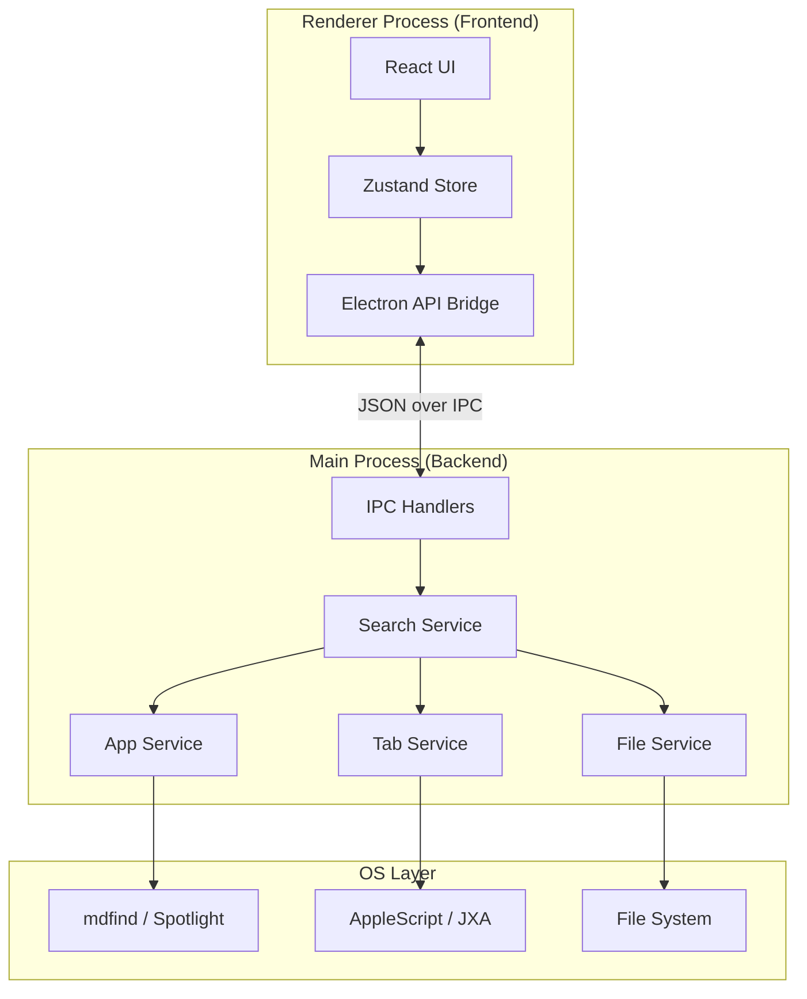

# Architecture & Design

## System Architecture

The new RAU architecture follows a **Service-Oriented Main Process** pattern, moving complex logic out of the UI and into specialized backend services.

## Core Components

### 1. Main Process Services

#### `SearchService`
The central coordinator. It receives queries, distributes them to sub-services (Apps, Tabs, Files), aggregates results, ranks them, and returns a unified list.
- **Responsibility**: Orchestration, Ranking, Filtering.
- **Optimization**: Uses `Promise.allSettled` for parallel execution.

#### `AppService`
Handles application indexing and launching.
- **Responsibility**: List installed apps, cache app list, launch apps.
- **Tech**: `mdfind` for discovery, in-memory caching with TTL.

#### `TabService`
Interacts with browsers to fetch and activate tabs.
- **Responsibility**: Get open tabs from Safari/Chrome/Arc, activate specific tabs.
- **Tech**: Optimized AppleScript/JXA.

#### `WindowService`
Manages the Electron browser window.
- **Responsibility**: Show/Hide, Resize, Position, Tray icon.

### 2. Renderer Process

#### `AppStore` (Zustand)
Single source of truth for UI state.
- **State**: `query`, `results`, `selectedIndex`, `filters`.
- **Persistence**: Persists user preferences (e.g., filters) to `localStorage`.

#### `ResultsList` (Component)
Virtualized list for high performance with large result sets.
- **Tech**: `@tanstack/react-virtual`.
- **Features**: Keyboard navigation support, efficient DOM recycling.

### 3. Shared Layer

#### `types/`
TypeScript interfaces shared between Main and Renderer.
- Ensures the "contract" is respected on both sides.

#### `schemas/`
Zod schemas for runtime validation of IPC messages.
- Prevents malformed data from crashing the main process.

## Data Flow

### Search Flow
1. **User** types "safari" in `SearchBar`.
2. **React** updates local state `query`.
3. **useSearch** hook debounces input (or uses `useDeferredValue`).
4. **Renderer** calls `electronAPI.search({ query: 'safari' })`.
5. **IPC Main** intercepts `search` channel.
6. **Zod** validates the payload.
7. **SearchService** calls `AppService.find('safari')` and `TabService.find('safari')` in parallel.
8. **Services** return `SearchResult[]`.
9. **SearchService** merges, sorts by score, and slices top 20.
10. **IPC Main** returns results to Renderer.
11. **Renderer** updates `AppStore.results`.
12. **UI** renders the new list.

## Security Model

- **Context Isolation**: Enabled (`contextIsolation: true`).
- **Sandbox**: Enabled where possible.
- **IPC**: Only exposed via `preload.ts` using `contextBridge`.
- **Validation**: All IPC inputs validated with Zod schemas.
- **CSP**: Strict Content Security Policy applied to Renderer.
